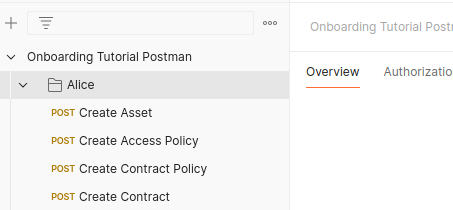

# 3. Set up Provider Offer

In this part, you will create a **Data Offer** and make it available in the **Vision-X Dataspace**.

The **Provider Connector** is called **Alice**.

*Please go to the Postman folder called Alice.*

---

## 📄 Create Asset

The first step is to create an **Asset** for a file in an **Amazon S3** bucket. This **Asset** will later be available to others as an **Offer** by creating a **Contract Definition**.

The **Asset** contains all the necessary information for the **Connector** to retrieve the file, as well as descriptions for others to see.

*In Postman, click on the `Create Asset` item and hit the `Send` button*

---

## 🛡️ Create Access Policy

Next, you need to create a **Policy Definition** that will be used as the **Access Policy** for the **Offer**.

The specific **Policy** here requires a **BpnCredential**. All **Participants** of the **Dataspace** already possess this **Credential** by default, and the **Connectors** will automatically present this **Credential** when communicating with one another.

*In Postman, click on the `Create Access Policy` item and hit the `Send` button*

---

## 📜 Create Contract Policy

Similar to the last step, create another **Policy Definition**, which will later be used as the **Contract Policy** for the **Offer**.

This particular **Policy** requires the **Business Partner Number (BPN)** of **Bob**, which acts as a unique identifier for **Participants** in the **Dataspace**.

*In Postman, click on the `Create Contract Policy` item and hit the `Send` button*

---

## 🤝 Create Contract Definition

In this step, you will create a **Contract Definition** that includes both the **Access Policy** and **Contract Policy** from the previous steps. The **Asset Selector** is configured to select only the **Asset** with the specific **ID** created in the first step.

When the **Catalog** is requested, the **Connector** will go through all the **Contract Definitions** that meet the **Access Policy** requirements and create an **Offer** for each **Asset** specified in the **Asset Selectors**.

*In Postman, click on the `Create Contract` item and hit the `Send` button*

---

With these steps, your **Data Offer** will be available for others in the **Vision-X Dataspace**! 🎉
