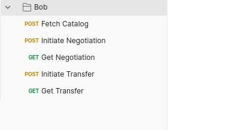

# 4. Transfer File to the Consumer

In this part, you will negotiate a **Contract Agreement** for the **Offer** created in the previous section and perform a **Transfer Process** for the **Offer**.

The **Consumer Connector** is called **Bob**.

*Please go to the Postman folder called Bob.*

---

## 📚 Fetch Catalog

The first step is to fetch the **Federated Catalog** containing all **Offers** from all **Participants** in the **Dataspace**.

The **Federated Catalog** is unique to each **Participant** and is periodically updated by querying all other **Connectors** for their catalogs. If your **Connector** does not satisfy the **Access Policy** of a **Contract Definition**, no **Offers** will be generated for that **Contract Definition**, and thus no **Offers** will be visible in your **Federated Catalog**.

*In Postman, click on the `Fetch Catalog` item and hit the `Send` button*

---

## 🤝 Initiate Negotiation

The next step is to take the **participantId** and **originator** from the **Catalog** where the desired **Offer** is located, as well as the entire **odrl:hasPolicy** of the **Offer**, and use them to initiate a **Contract Negotiation** with the **Participant** providing the **Offer**.

These values are automatically retrieved and stored as variables in the **Postman Collection**.

*In Postman, click on the `Initiate Negotiation` item and hit the `Send` button*

---

## 🆔 Get Negotiation ID

In this step, you will retrieve the **ID** of the **Contract Agreement**, which is generated once a **Contract Negotiation** has been successfully processed and reaches the 'FINALIZED' status.

This request should be made a few seconds after the previous step, as it may take a bit of time for the **Contract Negotiation** to reach the point where the **Contract Agreement** is generated.

The **ID** of the **Contract Agreement** is automatically retrieved and stored as variables in the **Postman Collection**.

*In Postman, click on the `Get Negotiation` item and hit the `Send` button*

---

## 🚀 Initiate Transfer

Now, you will initiate a **Transfer Process**, similar to the **Contract Negotiation**, by referencing the **Contract Agreement** using its **ID** and providing the necessary addresses and credentials for the **Connector** providing the **Offer** to place the file into an **Amazon S3** bucket.

The **ID** of the **Transfer Process** is automatically retrieved and stored as variables in the **Postman Collection**.

*In Postman, click on the `Initiate Transfer` item and hit the `Send` button*

---

## ✅ Get Transfer Status

In this final step, the **Transfer Process** should have reached the 'COMPLETED' state, meaning the file transfer has been successfully performed.

This request should also be made a few seconds after the previous step, as it takes some time for the file to be transferred and for the **Transfer Process** to reach the 'COMPLETED' state.

This step serves as confirmation that the transfer was indeed successful. 🎉

*In Postman, click on the `Get Transfer` item and hit the `Send` button*

---

With these steps, you have successfully negotiated a **Contract Agreement** and performed a **Transfer Process** for your **Offer** in the **Vision-X Dataspace**! 🎊
