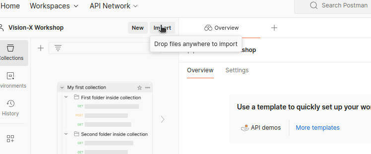
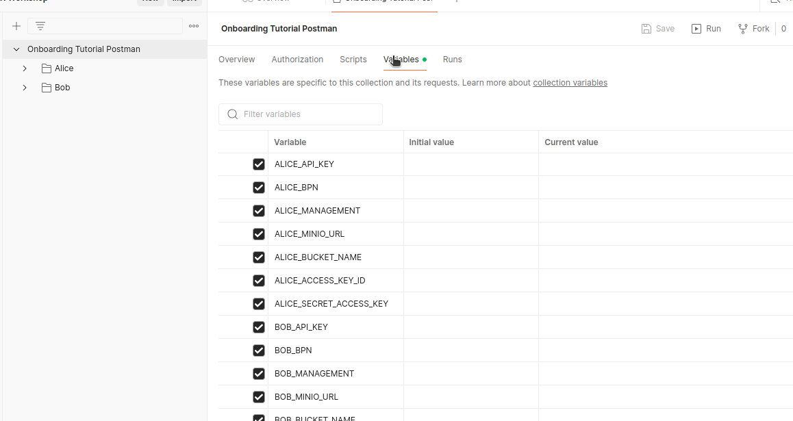
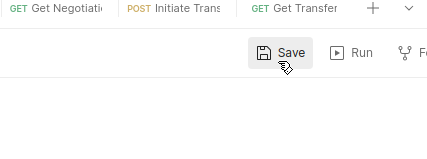

# 1. Set up Postman

Please start by downloading the Postman Collection from [here](../../collections/Onboarding%20Tutorial%20Postman.postman_collection.json).

## 1. Log in to Postman

**Visit the Postman Website**: Open your web browser and navigate to [Postman](https://www.postman.com).

**Sign In or Create an Account**:

- If you already have a Postman account, click on the **Sign In** button and enter your credentials.
- If you don’t have an account, click on **Sign Up** to create a new account. You can sign up using your email or through a Google or GitHub account.

## 2. Import the Postman Collection

Here, locate the postman collection you just downloaded.

## 3. Go to the Variables section

Here, provide the required values in the *Variables* section.

## 4. Copy these values into Postman

You need to copy the values into both, *Inital value* and *Current Value* fields.

| Variable                  | Values                                                                                    | Description                                                                                   |
|---------------------------|-------------------------------------------------------------------------------------------|-----------------------------------------------------------------------------------------------|
| `ALICE_API_KEY`           | `password`                                                                       | The X-Api-Key of the Provider                                                                 |
| `ALICE_BPN`               | `BPNL000000000001`                                                                   | The *Business Partner Number* of the Provider *Connector* (required for locating the *Offer* in the *Catalog*) |
| `ALICE_MANAGEMENT`        | `https://vision-x-dataspace.base-x-ecosystem.org/alice/management`    | The path to the Management URL of the Provider                                                |
| `ALICE_MINIO_URL`         |  `http://minio-alice.83a9eabf.nip.io/`                                                                                        | The URL to access your *Amazon S3* storage containing the file you want to transfer.         |
| `ALICE_BUCKET_NAME`       |   The name of the bucket from alice you created in step 2.                                                                                        | The name of the bucket where the file is located.                                            |
| `ALICE_ACCESS_KEY_ID`     |     `aliceawsclient`                                                                                     | A username for accessing your *Amazon S3* storage.                                           |
| `ALICE_SECRET_ACCESS_KEY` |      `aliceawsecret`                                                                                     | The password corresponding to the username for accessing your *Amazon S3* storage.          |
| `BOB_API_KEY`             | `password`                                                                       | The X-Api-Key of the Consumer                                                                  |
| `BOB_BPN`                 | `BPNL000000000002`                                                                   | The *Business Partner Number* of the Consumer *Connector* (required for setting a specific *Contract Policy*) |
| `BOB_MANAGEMENT`          | `https://vision-x-dataspace.base-x-ecosystem.org/bob/management`    | The path to the Management URL of the Provider                                                |
| `BOB_MINIO_URL`           |     `http://minio-bob.83a9eabf.nip.io/`                                                                                    | The URL to access your *Amazon S3* storage where you want the file to be transferred.        |
| `BOB_BUCKET_NAME`         |     The name of the bucket from bob you created in step 2.                                                                                         | The name of the bucket where you want the file to be transferred.                            |
| `BOB_ACCESS_KEY_ID`       |       `bobawsclient`                                                                                    | A username for accessing your *Amazon S3* storage.                                           |
| `BOB_SECRET_ACCESS_KEY`   |         `bobawsecret`                                                                                  | The password corresponding to the username for accessing your *Amazon S3* storage.          |
| `FILE_NAME`               |         `test-file.txt`                                                                                  | The name of the file you want to transfer.                                                   |
| `CONTRACT_POLICY_ID`               |        Please use a unique id here!                                                                                 | The *id* for the contract policy.                                                   |
| `CONTRACT_ID`               |        Please use a unique id here!                                                                                  | The *id* for the contract.                                                    |
| `ASSET_ID`               |         Please use a unique id here!                                                                                 | The *id* for the asset.
| `ACCESS_POLICY_ID`               |      Please use a unique id here!              | The *id* for the access policy.

## 5. Save the variables

After you copied all values, don't forget to save.
